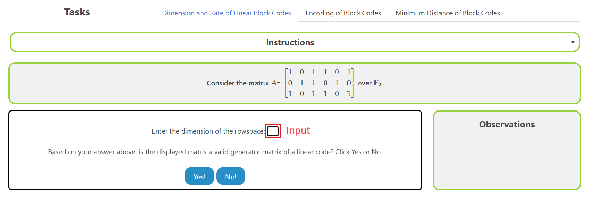
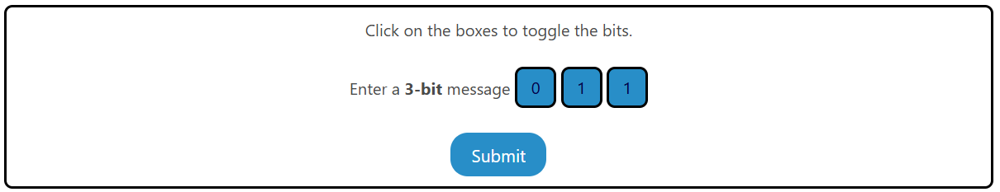
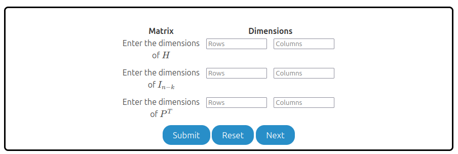
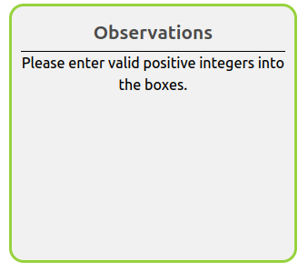
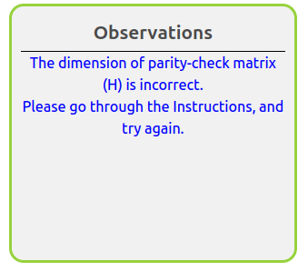
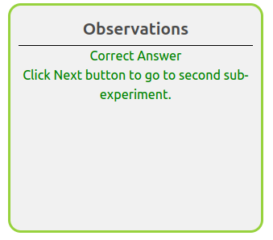
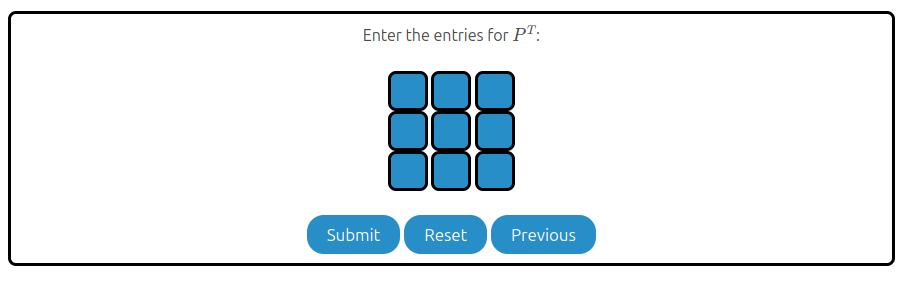
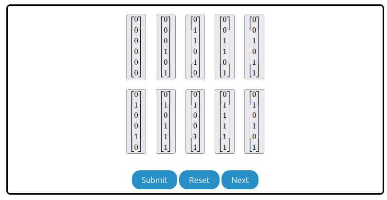
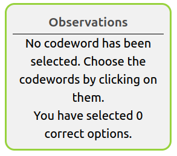
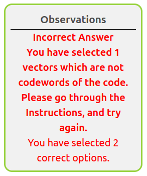

# Procedure

The experiment consists of two sub-experiments. The user is recommended to go through these in the same sequence as they are presented. 

0. Dimension of linear block code and its rate. 
    * Given generator matrix and/or parity check matrix, write down the dimension of the code and its rate. 
1. Encoding
    * For given generator matrix of the linear code, learn how to encode a message vector  
2. Learn how to calculate minimum distance.
    * For given generator matrix, calculate all codewords and the minimum weight. 
3. Learn how to compute parity check matrix, given generator matrix in systematic form. 
    * Compute the two blocks $I_{n-k}$ and $P^T$ and the overall structure of the parity check matrix.  
4. Learn to identify the codewords
    * Given parity check matrix, check if given vector is a codeword or not.     

## Overview of the Experiment window

    

The experiment window consists of the following components:
1. **Task tab**: The task tab contains the list of tasks that need to be performed in the experiment. The user can navigate to any task by clicking on the corresponding task in the task tab.
2. **Instruction box**: The instruction box displays step-by-step instructions to perform the task.
3. **Question box**: The question box displays the question to be answered by the user.
4. **Observation box**: The observation box displays the feedback messages based on the user's input.
5. **Action box**: The action box contains the input elements and buttons to perform the task.

## Sub-Experiment 1: Review of Linear Block Codes

There are three tasks in this sub-experiment.

### Task 1: Dimension and Rate

1. **Find Dimension**: Enter the dimension of the matrix shown in the input box provided as shown in the figure below. 
    
  

2. **Verify the Matrix**: Determine if the matrix is a valid generator matrix.  
    
  
  
    - Click on **Yes!** if the matrix is a valid generator matrix. 
    - Click on **No!** if the matrix is not a valid generator matrix.
    - The observation box will display the feedback message accordingly.  
      
 
       
      
      
      

3. **Calculate Code Rate**: Once a true generator matrix is identified and confirmed, calculate the rate of the code. The rate is given by the ratio of the dimension to the block length (length of the code). Enter the dimension and the block length in the input boxes provided.  
     
    - Click on **Check** to verify the correctness of the rate. The Observation box will display the feedback message accordingly. 
      

### Task 2: Encoding

1. **Encode Message**: Enter the message vector by clicking on the message bits.  
     
    - Click on **Encode** to encode the message vector. The entered codeword will be displayed in the Observation box and you will be take to next step.

2. **Enter Codeword**: Enter the codeword by clicking on the codeword bits.  
     
    - Click on **Check** to verify the correctness of the codeword. The Observation box will display the feedback message accordingly.

### Task 3: Minimum Distance

1. **Enter all codewords and hamming weight**: Enter all the codewords by clicking on the codeword bits and input the corresponding Hamming weight in the input box provided.  
     
    - Click on **Next** to verify the correctness of the minimum distance. The Observation box will display the feedback message accordingly.

2. **Enter the minimum distance**: Enter the minimum distance of the code in the input box provided.  
     
    - Click on **Check** to verify the correctness of the minimum distance. The Observation box will display the feedback message accordingly.

## Sub-Experiment 2: Parity Check Matrix

There are two tasks in this sub-experiment.

### Task 1: Structure of the parity-check matrix

1. **Find Dimensions of Matrices**: Enter the dimension of the matrices shown in the input boxes as row x column as shown in the figure below. 
    
    
2. **Verify Matrices**: To check the dimensions of matrices are correct.  
      
    - Click on **Submit** and check the dimensions of the matrices are valid.
    - Click on **Reset** to clear all the box entries.
    - Click on **Next** to go to the next sub-experiment.
    - The observation box will display the feedback message accordingly.  
      
       
      
      

3. **Fill out the sub-matrix entries**: For given blue 3x3 boxes fill out the bits into it. 
   
 To check the dimensions of matrices are correct or not.  
    
    - Click on **Submit** to verify the filled entries are right or wrong.
    - Click on **Reset** to clear all the box entries.
    - Click on **Previous** to go to the previous sub-experiment.
    - The observation box will display the feedback message accordingly.  
      
       
      
      
    
      

### Task 2: Identify Codewords

1. **Select Codewords**: Select the boxes given. After selecting, it will turn green, and it will turn back to gray boxes for deselecting. 
    
     
 To check the dimensions of matrices are correct or not.  
       
    <ul>
    <li> Click on <b>Submit</b> to verify the filled entries are right or wrong. </li>
    <li> Click on <b>Reset</b> to clear all the box entries. </li>
    <li> Click on <b>Next</b> to go to the next sub-experiment. </li>
    <li> Click on <b>Previous</b> to go to the previous sub-experiment. </li> 
    <li> The observation box will display the feedback message accordingly. </li>  
    </ul>
       
      
      
    